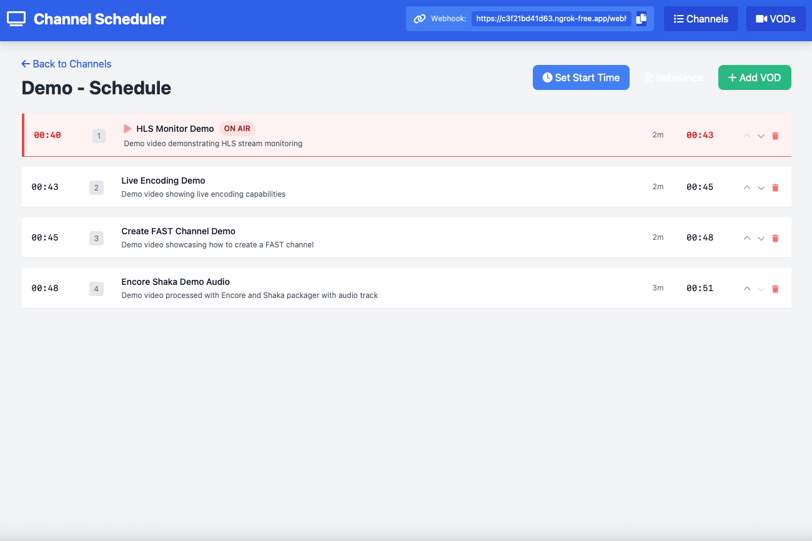

# Channel Scheduler

A web-based interface for scheduling and managing video content for [Eyevinn Channel Engine](https://app.osaas.io/browse/channel-engine) instances. This application provides a professional broadcast-style rundown interface for creating and managing linear TV channel schedules.



## Features

- **Professional Rundown Interface**: Compact, broadcast-style schedule view with start times and current playing indicators
- **Real-time Status**: Live webhook-based status monitoring of channel engines
- **Channel Management**: Create and manage multiple TV channels with integrated Channel Engine management
- **OSC Integration**: Native integration with Open Source Cloud (OSC) for automatic Channel Engine lifecycle management
- **File Upload & Transcoding**: Upload video files and automatically transcode to HLS format for broadcasting
- **S3 Storage Integration**: Automated MinIO S3 storage setup with input/output buckets for media processing
- **VOD Library**: Maintain a library of video on demand content with searchable sidebar interface
- **Schedule Management**: Add, reorder, and time content for automatic playback with intelligent looping
- **Webhook Integration**: Seamless integration with Channel Engine webhook system
- **Engine Management**: One-click creation, linking, and deletion of Channel Engine instances
- **Live Stream Preview**: Built-in HLS video players for monitoring channel outputs

## Quick Start with Eyevinn Open Source Cloud

The fastest way to get started is through **Eyevinn Open Source Cloud**, which provides instant deployment with zero setup required.

**🚀 Deploy in One Click:**

1. Visit [Channel Engine Scheduler on Open Source Cloud](https://docs.osaas.io/osaas.wiki/Service%3A-Channel-Engine-Scheduler.html)
2. Click **"Create scheduler"** to create your instance
3. Configure your OSC access token for Channel Engine management
4. Start scheduling immediately with professional broadcast tools

**Benefits:**
- ✅ **Zero Setup** - No dependencies or server management
- ✅ **Automatic Scaling** - Built-in reliability and performance
- ✅ **Integrated Billing** - Pay-as-you-use pricing
- ✅ **OSC Native** - Seamless Channel Engine integration
- ✅ **SSL & Security** - HTTPS endpoints and secure webhooks

Perfect for production use, demos, and teams who want to focus on content scheduling rather than infrastructure.

---

## Local Development Setup

For local development or self-hosted deployments, follow the setup instructions below.

## Prerequisites

- Node.js 16+ and npm
- OSC (Open Source Cloud) account for Channel Engine management (optional but recommended)
- [Eyevinn Channel Engine](https://app.osaas.io/browse/channel-engine) instances (can be created automatically)

## Setup

### 1. Clone and Install

```bash
git clone <repository-url>
cd channel-scheduler
npm install
```

### 2. Database Setup

```bash
# Set up the SQLite database
npx prisma migrate dev
```

### 3. Environment Configuration

Create a `.env` file:

```env
PORT=3000
PUBLIC_URL="http://localhost:3000"
DATA_DIR="./data"
OSC_ACCESS_TOKEN="your-osc-access-token"  # Optional: For automated Channel Engine management

# Upload Configuration (Optional)
MAX_UPLOAD_SIZE="10485760"      # 10MB max request body size (default: 10MB)
MAX_CHUNK_SIZE="8388608"        # 8MB max chunk size (default: 8MB)
S3_PART_SIZE="5242880"          # 5MB S3 multipart upload part size (default: 5MB)
S3_QUEUE_SIZE="4"               # Number of concurrent S3 upload parts (default: 4)
```

#### OSC Integration (Recommended)

To enable automatic Channel Engine management, obtain your OSC access token:

1. Go to [OSC Dashboard](https://app.osaas.io/)
2. Navigate to **Settings > Access Tokens**
3. Create a new access token with Channel Engine permissions
4. Add the token to your `.env` file as `OSC_ACCESS_TOKEN`

With OSC integration enabled, you can:
- Create Channel Engine instances directly from the UI
- Automatically detect and link existing engines
- Monitor engine status and stream URLs
- Delete engines when removing channels
- Upload and transcode video files using automated S3 storage
- Access MinIO storage buckets for media management

For webhook functionality, you'll need a publicly accessible URL. Use ngrok for development:

```bash
# Install ngrok if you haven't already
npm install -g ngrok

# Start ngrok tunnel
ngrok http 3000

# Update your .env file with the ngrok URL
PUBLIC_URL="https://your-ngrok-url.ngrok-free.app"
```

### 4. Start the Application

```bash
npm start
```

The application will be available at `http://localhost:3000`

## Channel Engine Management

The Channel Scheduler now provides **automated Channel Engine management** through OSC integration. You have two options for setting up Channel Engines:

### Option 1: Automatic Management (Recommended)

With OSC integration enabled, Channel Engine instances are managed automatically:

1. **Create Channel**: Add a new channel in the scheduler
2. **Create Engine**: Click "Create Engine" button on the channel card
3. **Automatic Configuration**: The engine is created with matching name and webhook URL
4. **Monitor Status**: View live status and stream preview in the UI

The system automatically:
- ✅ Creates Channel Engine instances with sanitized names (alphanumeric only)
- ✅ Configures webhook URLs for seamless integration
- ✅ Detects existing engines and offers linking options
- ✅ Provides live stream previews with HLS video players
- ✅ Cleans up engines when channels are deleted

### Option 2: Manual Setup

If you prefer manual control or don't have OSC integration:

1. **Create Channel Engine Instance**:
   - Go to [OSC Channel Engine](https://app.osaas.io/browse/channel-engine)
   - Create instance with name matching your channel (alphanumeric only)
   - Configure webhook URL: `https://your-domain.com/webhook/nextVod`

2. **Link to Channel**:
   - The scheduler will detect running engines
   - Click "Link Engine" if an unlinked engine is found
   - Or manually configure the channel with the engine name

### Engine Status Indicators

The channel cards display comprehensive engine status:

- 🔵 **Blue**: Channel has linked Channel Engine (ready to stream)
- 🟠 **Orange**: Unlinked engine detected (click to link)
- ⚪ **Gray**: No engine instance (click to create)
- 🟢 **Green**: Additional webhook configuration status

### Channel Engines Tab

Access the dedicated **Engines** tab to:
- View all Channel Engine instances across your OSC account
- Monitor status (running, stopped, starting)
- Preview live streams with built-in video players
- Filter to show only WebHook-type engines
- Identify which engines are connected to this scheduler

## Usage

### 1. Create a Channel

1. Click **"Add Channel"** in the Channels view
2. Enter channel name (will be sanitized for engine creation)
3. Set description and optional settings
4. Configure schedule start time
5. Enable automatic back-to-back scheduling if desired
6. **Optional**: Click "Create Engine" to automatically create a Channel Engine instance

### 2. Add VOD Content

#### Option A: Upload and Transcode Video Files

1. Switch to the **VODs** tab
2. Click **"Add VOD"**
3. Use the **File Upload** section to:
   - Select a video file (MP4, MOV, AVI, etc.)
   - Upload with real-time progress tracking
   - Automatically transcode to HLS format using Eyevinn FFmpeg S3
   - Monitor transcoding progress with live status updates
4. Enter title and description
5. The HLS URL is automatically configured after transcoding completes

#### Option B: Add Existing HLS Content

1. Switch to the **VODs** tab
2. Click **"Add VOD"**
3. Enter title, description, and HLS URL
4. Use **"Detect"** to automatically determine duration from HLS manifest
5. Optionally add preroll content

### 3. Schedule Content

1. Select a channel to view its schedule
2. Click **"Add VODs"** to open the searchable sidebar
3. Search and click any VOD to add it to the schedule (automatic back-to-back scheduling)
4. Use **"Rebalance"** to redistribute timing across all scheduled content
5. Monitor the **"ON AIR"** indicator to see what's currently playing
6. Schedule automatically loops back to the beginning when reaching the end

### 4. Monitor Status and Streams

- **Engine Status**: Real-time status indicators (running, stopped, starting)
- **Live Stream Preview**: Built-in HLS video players for each Channel Engine
- **Online/Offline Status**: Shows if the Channel Engine is actively requesting content
- **Current Playing**: Red border and "ON AIR" indicator show what's currently broadcasting
- **Webhook Activity**: Status updates automatically based on webhook calls from Channel Engine
- **Channel Engines Tab**: Dedicated view for monitoring all engine instances with stream previews

## Upload and Transcoding Workflow

The Channel Scheduler provides an integrated media pipeline for processing video files:

### Automatic S3 Storage Setup

When OSC integration is enabled, the system automatically:
- Creates a MinIO S3-compatible storage instance (`schedulerstorage`)
- Sets up `input` and `output` buckets with appropriate permissions
- Configures public read access for the output bucket

### File Upload Process

1. **Smart Upload Strategy**: Files larger than 8MB use chunked upload (5MB chunks)
2. **Deployment-Friendly**: Small chunks bypass reverse proxy body size limits  
3. **Automatic Retry Logic**: Failed chunks are retried up to 3 times with backoff
4. **Progress Tracking**: Real-time progress with chunk-level indicators
5. **Format Support**: MP4, MOV, AVI, MKV, and other common video formats

### Automated Transcoding

- **HLS Conversion**: Files are automatically transcoded to HLS format for broadcasting
- **Eyevinn FFmpeg S3**: Uses the Eyevinn FFmpeg S3 service for high-quality transcoding
- **Status Monitoring**: Real-time transcoding progress with completion notifications
- **Output Management**: Transcoded files are stored in the public output bucket

### Integration Benefits

- **Seamless Workflow**: Upload → Transcode → Schedule → Broadcast in one interface
- **No External Dependencies**: All processing happens within your OSC environment
- **Broadcast-Ready Output**: HLS segments optimized for Channel Engine compatibility
- **Automatic Cleanup**: Failed jobs and temporary files are managed automatically

## API Endpoints

### Webhook Endpoints

- `GET /webhook/nextVod?channelId=CHANNEL_ID` - Returns next scheduled content
- `GET /webhook/health` - Health check endpoint

### Management API

- `GET /api/channels` - List all channels
- `POST /api/channels` - Create new channel
- `GET /api/channels/:id/schedule` - Get channel schedule
- `GET /api/channels/:id/current` - Get currently playing content
- `GET /api/vods` - List all VODs
- `POST /api/vods` - Create new VOD

### Channel Engine API

- `GET /api/channel-engines` - List all Channel Engine instances
- `POST /api/channels/:id/channel-engine` - Create Channel Engine for channel
- `DELETE /api/channels/:id/channel-engine` - Delete Channel Engine instance
- `POST /api/channels/:id/channel-engine/link` - Link existing engine to channel

### Upload and Transcoding API

- `POST /api/upload-file` - Upload video file to S3 storage with progress tracking
- `POST /api/transcode-file` - Create transcoding job for uploaded file
- `GET /api/transcode-status/:jobId` - Get transcoding job status
- `DELETE /api/transcode-job/:jobId` - Delete transcoding job

### Storage Management API

- `POST /api/setup-minio` - Create MinIO instance with input/output buckets
- `GET /api/minio-config` - Get MinIO instance configuration

## Development

### Database Management

```bash
# Generate Prisma client
npx prisma generate

# View database in browser
npx prisma studio

# Reset database
npx prisma migrate reset
```

### Project Structure

```
├── src/
│   ├── server.js         # Main server and API routes
│   ├── webhook.js        # Webhook handling logic
│   ├── oscClient.js      # OSC integration and Channel Engine management
│   └── schedulingUtils.js # Schedule timing and rebalancing logic
├── public/
│   ├── index.html        # Main UI with Channel Engines tab
│   └── app.js           # Frontend JavaScript with engine management
├── prisma/
│   ├── schema.prisma     # Database schema
│   └── migrations/       # Database migrations
└── package.json
```

## Troubleshooting

### OSC Integration Issues

1. **"OSC not configured" error**: Add your `OSC_ACCESS_TOKEN` to `.env` file
2. **Cannot create engines**: Verify your OSC token has Channel Engine permissions
3. **Engine not detected**: Check that the engine name matches the sanitized channel name (alphanumeric only)

### Channel Engine Not Responding

1. Check the **Engines** tab to verify engine status (running/stopped)
2. Ensure the webhook URL is publicly accessible (use ngrok for development)
3. Verify the engine is linked to the correct channel (check for orange "Unlinked" warnings)
4. Use the built-in video player to test if the stream is working

### Content Not Playing

1. Verify VOD URLs are accessible and valid HLS streams
2. Check that content is properly scheduled with valid start/end times
3. Ensure the channel has a schedule start time set
4. Verify the Channel Engine is calling the webhook (check Online/Offline status)
5. Monitor the live stream preview to see if content is actually broadcasting

### Engine Management Issues

1. **"Create Engine" button not showing**: An engine with the same name may already be running
2. **Engine creation fails**: Check OSC account limits and permissions
3. **Stream not playing in preview**: Verify the HLS URL is accessible and the engine is running
4. **Engines not listed**: Ensure OSC_ACCESS_TOKEN is configured and valid

### Upload and Transcoding Issues

1. **Upload fails or incomplete**: 
   - Check file size (max 100GB supported)
   - Verify network stability for large files
   - Ensure MinIO storage is properly configured

2. **Transcoding fails**:
   - Verify input file format is supported (MP4, MOV, AVI, MKV)
   - Check OSC account limits for transcoding services
   - Ensure file was completely uploaded before transcoding started

3. **"MinIO not configured" error**:
   - Add `OSC_ACCESS_TOKEN` to environment variables
   - Run setup-minio API endpoint or restart application
   - Check OSC account permissions for MinIO service

4. **Transcoding never completes**:
   - Monitor job status via API or browser console
   - Large files may take significant time to process
   - Check if transcoding service instance is running in OSC

5. **Upload progress not showing**:
   - Ensure modern browser with XMLHttpRequest support
   - Check network connectivity during upload
   - Large files may show chunked progress updates

### Database Issues

```bash
# Reset and recreate database
npx prisma migrate reset
npx prisma migrate dev
```

## Deployment

### Docker Deployment

For self-hosted deployments using Docker:

```bash
# Clone the repository
git clone <repository-url>
cd channel-scheduler

# Build and run with docker-compose
docker-compose up -d
```

The application will be available at `http://localhost:3000`. Data is persisted in a Docker volume.

#### OSC Integration

When deploying as a service in OSC (Open Source Cloud), the container automatically configures itself:

1. Set the `OSC_HOSTNAME` environment variable to automatically configure webhook URLs
2. The container will set `PUBLIC_URL=https://${OSC_HOSTNAME}` automatically
3. SQLite database is stored in a persistent volume at `/app/data`

**Docker Environment Variables:**

```yaml
environment:
  - OSC_HOSTNAME=your-instance.osaas.io  # Auto-sets PUBLIC_URL
  - OSC_ACCESS_TOKEN=your-osc-token      # For Channel Engine management
  # OR set PUBLIC_URL directly:
  # - PUBLIC_URL=https://your-domain.com
```

#### Custom Docker Deployment

```bash
# Build the image
docker build -t channel-scheduler .

# Run with volume for database persistence
docker run -d \
  --name channel-scheduler \
  -p 3000:3000 \
  -v channel_data:/app/data \
  -e OSC_HOSTNAME=your-hostname.example.com \
  -e OSC_ACCESS_TOKEN=your-osc-token \
  channel-scheduler
```

### Manual Deployment

For traditional hosting without Docker:

```bash
# Clone and install
git clone <repository-url>
cd channel-scheduler
npm install

# Set up database
npx prisma migrate deploy

# Set environment variables
export PUBLIC_URL="https://your-domain.com"
export PORT=3000
export DATA_DIR="/app/data"
export OSC_ACCESS_TOKEN="your-osc-token"  # Optional: For engine management

# Start with process manager
pm2 start index.js --name channel-scheduler
```

## License

MIT License - see [LICENSE](LICENSE) file for details.

Copyright (c) 2025 Eyevinn Technology AB
